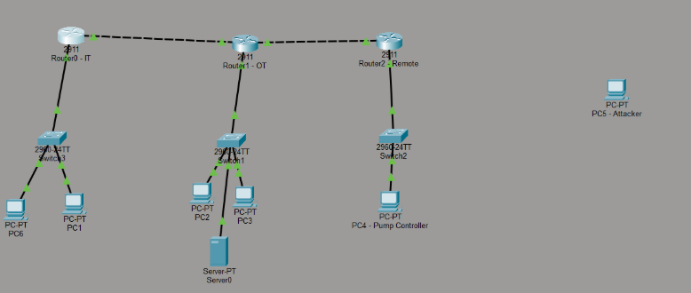
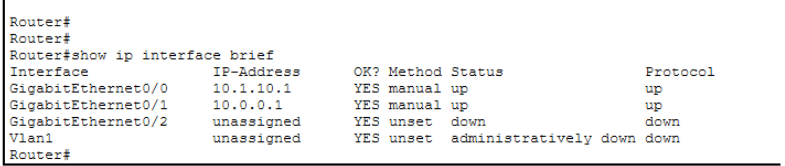
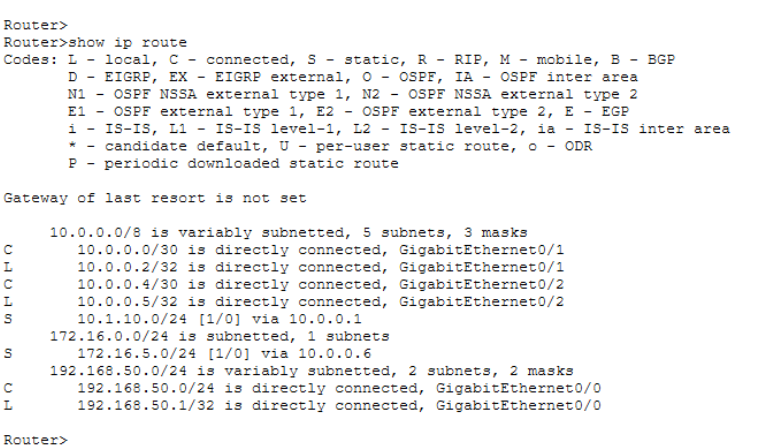
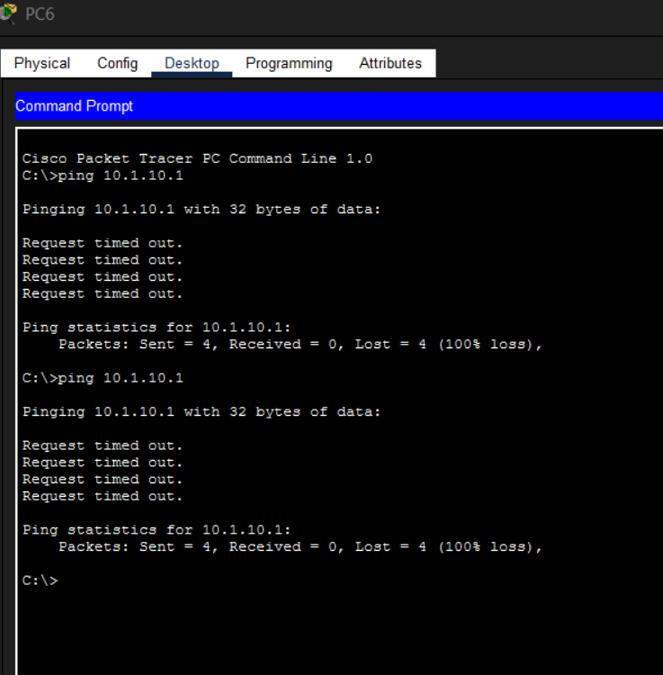

# Lab 04 – Enterprise LAN Security Assessment

## Part 1: Network Architecture

### Topology

### IP Configuration

### Routing Table

### MAC Address Table

### Connectivity Test

---

## Part 2: Protocol Security

TCP uses a three-way handshake which makes it more reliable and easier to monitor. UDP is connectionless and does not verify delivery, making it less secure.

HTTPS encrypts data using TLS, while HTTP sends data in plain text.

SSH encrypts communication, while Telnet sends data in cleartext.

---

## Part 3: Shellshock

(paste your paragraph here)

---

## Part 4: Incident Response

Attacker → Web Server → SCADA → Data exfiltration

(paste your remediation paragraph here)

---

## Part 5: OSI Model

Layer 1 – Physical (cables)  
Layer 2 – Data Link (switch, MAC)  
Layer 3 – Network (IP, routing)  
Layer 4 – Transport (TCP/UDP)  
Layer 7 – Application (HTTP/HTTPS/SSH)
